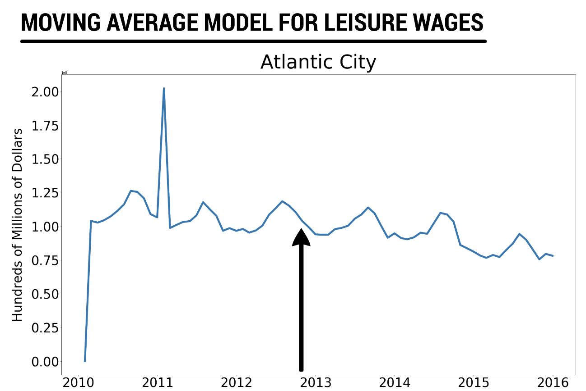
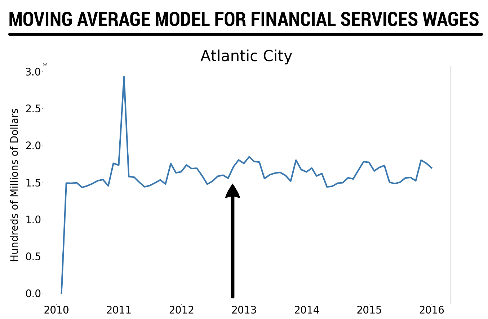
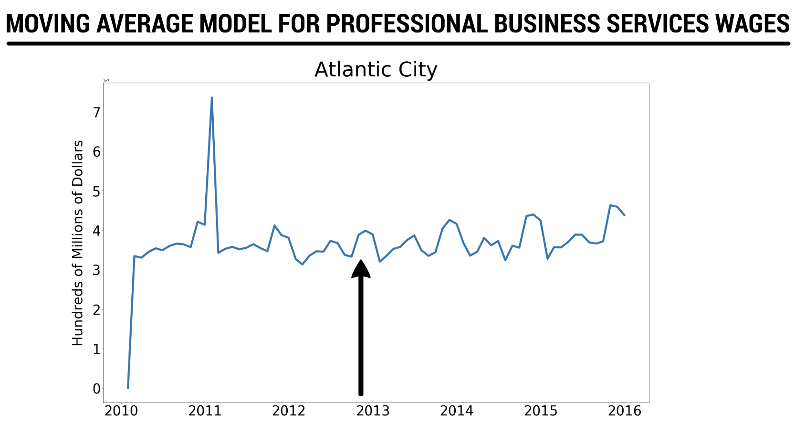
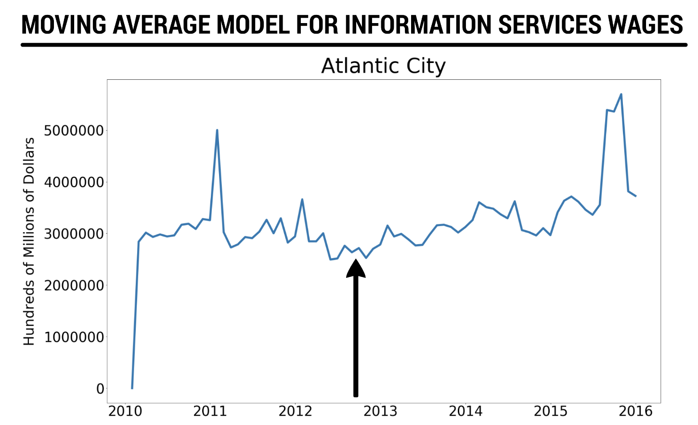
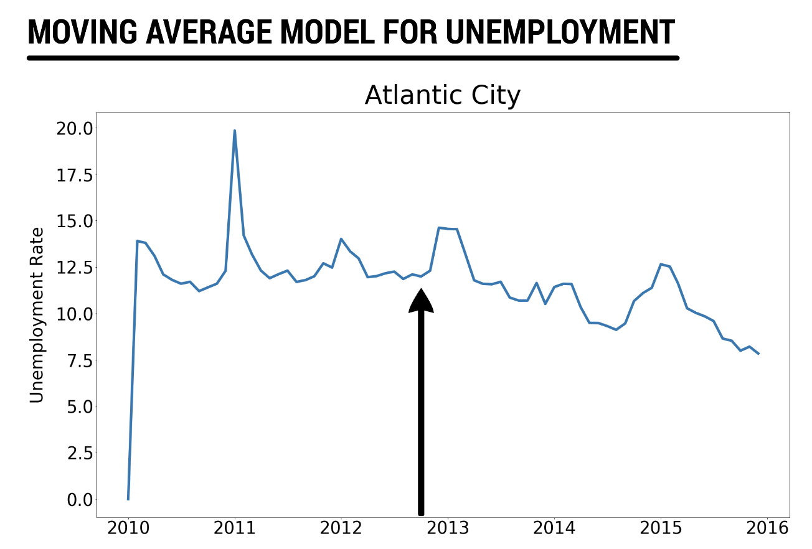

# Client Project - Measuring the Economic Impact of a Natural Disaster

### David Bertsch, Mekdes Kebede, Chris Langan, Noah Monastersky

### April 29, 2019

## Problem Statement

How can we measure the economic impact of a disaster in terms of wages and unemployment?

## Plan

In order to approach this problem, we took a look at an isolated natural disaster and investigated the economic impact that the disaster had on different localities. In this project, we used Hurricane Sandy as a case study.

We first selected some relevant localities for analysis. Since we were investigating Hurricane Sandy, we selected Mid-Atlantic and Northeast coastal cities in the United States. This part of the United States was most directly in the path of the storm.

The following localities were analyzed:

- Atlantic City, NJ
- Baltimore, MD
- Boston, MA
- Bridgeport, CT
- New Haven, CT
- New London, CT
- Newport, RI
- Ocean City, MD
- Portland, ME
- Providence, RI

We analyzed the wages and unemployment in these localities. The wage data was broken down by industry, and we investigated how wages in each of these industries were impacted by Sandy.

In order to compare the relative impact of the storm in each of the localities of analysis, we also investigated weather data to show the intensity of the storm conditions. We were interested to see to what extent the relative economic impact in each locality was reflected by the relative intensity of the storm in each locality.

## Hypotheses

The following hypotheses framed the focus of our analysis:

1. The occurrence of a natural disaster will negatively affect wages in the tourism industries.

In general, we thought that the occurrence of a disaster would have an economic impact on localities in the path of the disaster. The economic metrics that we analyzed were wages and unemployment, so we thought that we would see a drop in wages and an uptick in unemployment in the localities of analysis at the time immediately following Hurricane Sandy.

2. The occurrence of a natural disaster will not significantly affect wages in professional industries.

We thought that tourism industries would experience the largest impact from a disaster, because those industries are based on people visiting, and people spending money. During a disaster event like a hurricane, we would expect that, for a somewhat extended period of time surrounding the disaster, there would be a major dip in any tourism-related spending, and that this may ultimately be reflected in wages.

3. The occurrence of a natural disaster will not significantly affect wages in professional industries. 

Conversely, we did not think that wages in professional industries would be impacted significantly by the occurrence of a disaster. While these industries may lose some productivity related to having to close offices for a brief time, we felt that this would not be nearly enough to result in a significant drop in wages.

4. The relative intensity of a disaster in a given locality will be correlated to any negative impact on wages and unemployment.

We thought that any localized economic impact resulting from a disaster would be proportional to the relative intensity of the disaster in that locality.

## Github Project Directory

### Data Gathering

- [Wages and Unemployment Data Gathering Notebook](./BLS-API_MK.ipynb)

This is where we used BLS's API to pull in wage data.
- [Precipitation and Wind Data Gathering Notebook](./NOAA_weather_data_compile-DB.ipynb)

This is where we brought in precipication and wind data.

### Data Cleaning
- [Data Cleaning Notebook](./cleaning_notebook_nm.ipynb)

This is where we cleaned the data into dataframes ready to model.

### Modeling
- [Wage SARIMA Notebook](./wage_analysis_sarima-DB.ipynb)

This is where we modeled our wage data.
- [Unemployment SARIMA Notebook](./unemployment_monthly-DB.ipynb)

This is where we modeled our unemployment data.

### Plotting
- [Barometric Pressure Plotting Notebook](./baro-pressure-hourly-final.ipynb)

This is where we plotted our barometric pressure data.
- [Precipitation Plotting Notebook](rain-wind-daily-readings.ipynb)

This is where we plotted our precipitation data.

## Data

#### Wages

We gathered data on wages broken down by localities from the Bureau of Labor Statistics (BLS) through their API. (Information on how to use the BLS API can be found here: https://www.bls.gov/developers/home.htm) Specifically, we pulled data related to wages in our localities of analysis broken down into industries. This data was taken from the Quarterly Census of Labor and Wages reports.

The data for wages is broken down into the following categories:

- natural resources and mining
- construction
- manufacturing
- service-providing
- trade, transportation, and utilities
- information
- financial activities
- professional and business services
- education and health services
- leisure and hospitality
- other services
- unclassified

Wage data shortcomings:

When collecting the economic data we collected wage and unemployment data but were only able to find monthly data for these two statistics which limited how much we were able to see the effects of natural disasters which often impact communities immediately. Additionally, our wage datasets had many missing values which meant that some industries we could not effectively model and make conclusions about. When using BLS's API to get our wage data we were only able to bring in private industry data and were having difficulties bringing in government and non-profit industry data. This limited the amount of wage data we were able to gather on industries and it might be that government and non-profits are impacted differently from natural disasters compared to private industries. It is also worth noting that wages are not the best at measuring the economic impact of the sudden changes that natural disasters cause but are better measurements of how in demand different fields are. One possible alternative that we could use in the future to measure the economic impact of sudden changes would be sales per day in a given locality.

#### Unemployment

We collected data on unemployment rates in our localities of analysis from the St. Louis Federal Reserve Board's website. This data was available in downloadable CSV files that included monthly unemployment rates.

#### Weather

In order to obtain historical weather data related to storm conditions, we gathered data from the National Oceanic and Atmospheric Administration (NOAA).

We collected data for the following weather metrics:

- barometric pressure
- precipitation
- maximum sustained 2 minute wind speed
- maximum sustained 5 second wind speed
- tide levels

We acquired precipitation and wind data through the use of NOAA's Climate Data Online Search (https://www.ncdc.noaa.gov/cdo-web/search). Historical data on barometric pressure and tide levels was readily available in downloadable CSV files. Ultimately, we did not use the tide level data as a metric to measure storm intensity.

Weather data shortcomings:

When I collected tide levels for each of the localities there were not consistent patterns on how many readings were taken per day so some days would have more readings than other days. Even though there were not consistent readings per day, tide readings were consistent in that they had readings every single day. When I collected barometric pressure statistics there were instances where there would be multiple months worth of data missing, which according to an employee at NOAA was most likely due to problems with the machines taking the readings.

## Methodology

Because natural disasters occur suddenly, we are trying to assess the sudden fluctuations in the economic data that may have occurred in the months following Hurricane Sandy, which occurred in October 2012. That means that, in the context of ARIMA modeling, we are interested in extracting the moving average component of this data (which handles sudden fluctuations), and ignoring the auto-regressive component of this data (which handles long-term trends). Because we have obvious seasonality in this data, we will take one order of seasonal differencing (12 months) before fitting the models.

We will perform this analysis on both the wage data and the unemployment data. We will perform a qualitative analysis of these time series in order to investigate if there is any noticeable change in wages or unemployment due to Hurricane Sandy.

## Results

In general, we did not see any obvious fluctuation in the moving average wages for any locality and for any industry. Because Atlantic City had the most extreme storm conditions, we will include sample plots from our moving average wage models below. As opposed to wages, we see a small uptick in unemployment at the beginning of 2013 that may potentially be attributed to Hurricane Sandy, but it is not a large enough increase for us to make any meaningful conclusions. Atlantic City experienced the largest increase, and that plot is shown below.

## Conclusions

We will return to our hypotheses in order to evaluate our results.

1. The occurrence of a natural disaster will lead to a pronounced loss of wages and increase in unemployment.

We did not see evidence that wages are impacted by natural disasters. We saw inconclusive evidence that unemployment increases as a result of a natural disaster.

2. The occurrence of a natural disaster will negatively affect wages in tourism industries.

We saw no evidence that wages in tourism industries are affected by the occurrence of a natural disaster.

3. The occurrence of a natural disaster will not significantly affect wages in professional industries. 

The results were in line with the hypothesis that wages in professional industries are not impacted by the occurrence of a natural disaster, although that is a relatively trivial conclusion since wages generally seemed to not be impacted by the occurrence of a disaster.

4. The relative intensity of a disaster in a given locality will be correlated to any negative impact on wages and unemployment.

We saw inconclusive evidence to support this. Out of the localities that we analyzed, the largest uptick in unemployment following Hurricane Sandy occurred in Atlantic City, which also experienced the most intense storm conditions of the localities that we analyzed. However, due to the limited scope of our analysis and due to the limited timeframe of our data, we cannot make any meaningful conclusions based on this.

## Recommendations

Moving forward, we would be interested in analyzing other economic metrics that may be more impacted by the occurrence of a natural disaster. We would probably not study wage data again for this problem. We probably would look further into the potential impact on unemployment from natural disasters by looking at other instances of disasters and expanding the duration of the time series data. Some other metrics that we would be curious to look into would be daily sales data and insurance claims because we feel that they might be more responsive to sudden shocks to the system as compared to wages. In any case, we would recommend acquiring significantly more data than we did in order to improve the time series modeling. Since we were modeling with a seasonal difference of one year, and since we only collected six years of data, we only considered 5 years of data, which is not enough to build a quality time series model.

Additionally, if we had more time, we would have developed a methodology for making a quantitative estimate of the impact of a disaster. As it was, our data did not show enough of an out-of-the-norm-response to the occurrence of a disaster to conclude that there was any impact due to the disaster. At the same time, the ultimate goal of this project was to be able to estimate the economic impact of a disaster, so we eventually want to be able to make a quantitative measurement of the impact. In order to facilitate this, we need to collect more data, explore more economic metrics, and analyze more disasters.

*A link to our presentation can be found here: https://prezi.com/view/4gXbgpUtN7HvtMc7oABo/*

# DSI_Project_4-Measuring_Economic_Impact_of_Hurricane_Sandy
